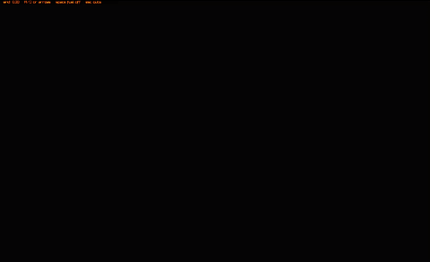

# Doom Fire

The PlayStation Doom fire, from [Fabien Sanglard's article](https://fabiensanglard.net/doom_fire_psx/index.html), in C# and raylib.

```
dotnet run
```

Each cell passes its heat to one neighbor above and cools by zero or one. A shader maps those indices through the 37-color palette and scales the grid to the screen.



## Controls

- A, D, or the arrow keys lean the flames
- Space toggles the fuel. Off lets the flames already burning die out
- 1 toggles smoothing and glow
- 2 cycles the flame palette
- Esc quits
